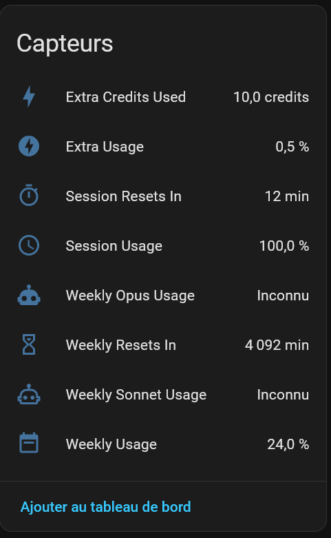

# Claude Usage — Home Assistant Integration

Monitor your Claude.ai session usage and weekly limits directly in Home Assistant.



## What it does
Polls `claude.ai` at a configurable interval (default: every 60 seconds) and exposes your usage as native HA sensors:

| Sensor | Description | Unit |
|--------|-------------|------|
| Session Usage | How much of your current 5-hour session you've used | % |
| Session Resets In | Time until the session resets | min |
| Weekly Usage | How much of your weekly allowance you've used | % |
| Weekly Resets In | Time until the weekly allowance resets | min |
| Weekly Sonnet Usage | Weekly Sonnet-specific limit (if on your plan) | % |
| Weekly Opus Usage | Weekly Opus-specific limit (if on your plan) | % |
| Extra Credits Used | Extra usage credits consumed this month | credits |
| Extra Usage | Extra usage as a percentage of monthly limit | % |

All sensors appear under a single **Claude Usage** device.

## Requirements

- Home Assistant 2024.1 or later
- A Claude.ai account (Pro, Max, Team, or Enterprise plan)
- Access to your browser DevTools to retrieve session cookies

---

## Installation

### Step 1 — Download the integration

Go to the [**Releases page**](https://github.com/juliensere/ha-cloud-usage/releases/latest) and download `claude_usage.zip` from the latest release.

Extract it into your Home Assistant `custom_components` directory:

```
/config/
└── custom_components/
    └── claude_usage/        ← extracted here
        ├── __init__.py
        ├── manifest.json
        ├── config_flow.py
        ├── coordinator.py
        ├── sensor.py
        ├── const.py
        ├── strings.json
        └── translations/
            ├── en.json
            └── fr.json
```

**Linux / macOS (one-liner):**

```bash
cd /config/custom_components
unzip ~/Downloads/claude_usage.zip
```

**Docker users:** replace `/config` with the volume you mounted when starting the HA container (typically `./homeassistant` or `/opt/homeassistant/config`).

### Step 2 — Restart Home Assistant

**Settings → System → Restart** and confirm.

### Step 3 — Retrieve your credentials

You need **three values** from your browser while logged into [claude.ai](https://claude.ai).

#### `sessionKey` and `cf_clearance`

1. Open [claude.ai](https://claude.ai) — make sure you are logged in
2. Open DevTools: `F12` (or `Cmd+Option+I` on macOS)
3. Go to the **Application** tab → **Cookies** → `https://claude.ai`
4. Find and copy the **Value** of:
   - `sessionKey`
   - `cf_clearance`

#### `org_id`

1. In DevTools, switch to the **Network** tab
2. Navigate to [claude.ai/settings/usage](https://claude.ai/settings/usage) (or reload it)
3. Filter requests by typing `usage` in the search box
4. Click on the request matching `/api/organizations/<uuid>/usage`
5. Copy the UUID from the URL — that is your `org_id`

### Step 4 — Add the integration

1. **Settings → Integrations → + Add integration**
2. Search for **Claude Usage**
3. Fill in the three fields and click **Submit**

HA tests the connection before saving. If it fails, the error message tells you which credential is wrong.

---

## Session management

### How long do cookies last?

| Cookie | Typical lifetime | Notes |
|--------|-----------------|-------|
| `sessionKey` | Weeks to months | Stays valid as long as you remain logged in |
| `cf_clearance` | ~24 hours | **Auto-renewed** by the integration on every successful request |

Because the integration polls regularly, `cf_clearance` is silently renewed by Cloudflare and saved back to HA — no action needed on your part under normal use.

### What happens when a session expires?

If HA is stopped for more than 24 hours, `cf_clearance` may expire. When this happens:

1. A **repair notification** appears in the HA dashboard
2. Click **Fix** — a form opens asking for a fresh `sessionKey` and `cf_clearance`
3. Paste the new values (same DevTools process as above)
4. The integration reloads automatically — all sensors resume

You can also trigger a manual credential update at any time:  
**Settings → Integrations → Claude Usage → ⋮ menu → Reconfigure**

---

## Polling interval

The default polling interval is **60 seconds**. You can change it without reinstalling the integration:

**Settings → Integrations → Claude Usage → Configure**

| Setting | Default | Minimum | Maximum |
|---------|---------|---------|---------|
| Polling interval | 60 s | 10 s | 6 h (21 600 s) |

The integration reloads automatically after saving. Existing installations keep the 60 s default until you open this form and save.

---

## Using sensors in your dashboard

### Gauge card

```yaml
type: gauge
entity: sensor.claude_usage_session_usage
name: Claude Session
min: 0
max: 100
severity:
  green: 0
  yellow: 70
  red: 90
```

### Markdown card with reset countdown

```yaml
type: markdown
content: >
  ## Claude Usage

  **Session:** {{ states('sensor.claude_usage_session_usage') }}%
  — resets in {{ states('sensor.claude_usage_session_resets_in') }} min

  **Weekly:** {{ states('sensor.claude_usage_weekly_usage') }}%
  — resets in
  {{ (states('sensor.claude_usage_weekly_resets_in') | int / 60) | round(1) }} h
```

### Automation: alert when session is almost full

```yaml
automation:
  - alias: "Claude session almost full"
    trigger:
      - platform: numeric_state
        entity_id: sensor.claude_usage_session_usage
        above: 80
    action:
      - service: notify.mobile_app
        data:
          title: "Claude"
          message: >
            Session {{ states('sensor.claude_usage_session_usage') }}% used.
            Resets in {{ states('sensor.claude_usage_session_resets_in') }} min.
```

---

## Troubleshooting

| Symptom | Likely cause | Fix |
|---------|-------------|-----|
| Integration not found after restart | Files in the wrong folder | Verify path is `/config/custom_components/claude_usage/` |
| `Cannot connect` on setup | Network issue or wrong `org_id` | Check the UUID from DevTools; confirm HA can reach the internet |
| `Session expired` error | `sessionKey` invalid or expired | Paste a fresh `sessionKey` from DevTools |
| `Cloudflare token expired` error | `cf_clearance` invalid | Paste a fresh `cf_clearance` from DevTools |
| Sensors show `unavailable` | First fetch failed at startup | Check **Settings → System → Logs** for details |

---

## Privacy

Credentials are stored locally in HA's encrypted config entry storage. They are never sent anywhere other than `claude.ai`.

This integration is not affiliated with or endorsed by Anthropic.
